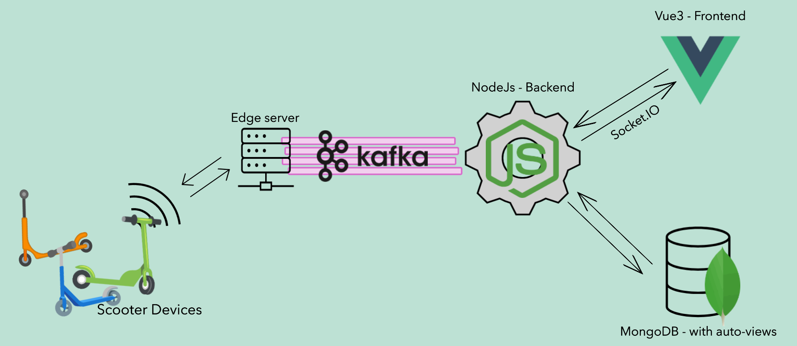
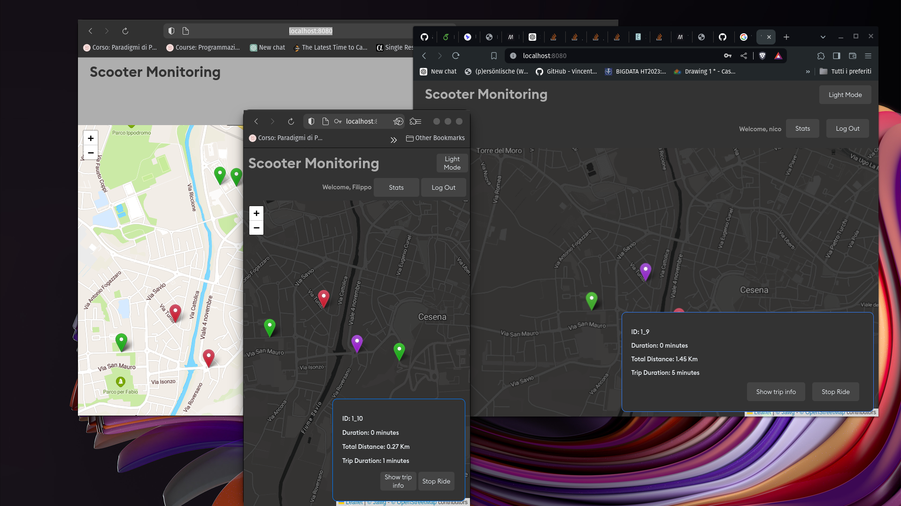
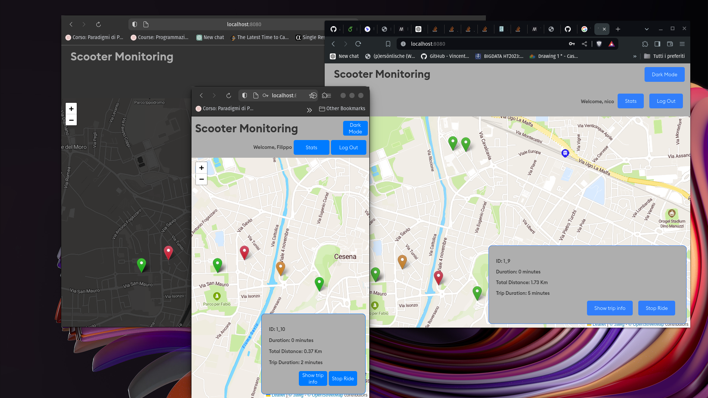
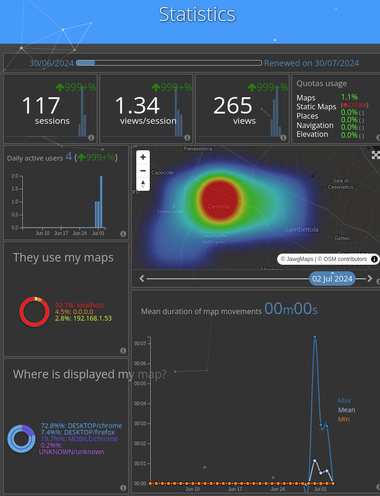

# Scooter Ride Application

## Overview

This application is a full-stack solution built using the MEVN (MongoDB, Express, Vue, Node.js) stack.
It provides a seamless experience for users to register, book, and ride scooters while offering a comprehensive dashboard for insights into scooter trip statistics and user behaviors.

## Features

- 🚀 **Scalable and Reliable**: The application is containerized using Docker, ensuring easy deployment and scaling.
- 🌐 **Real-time Communication**: Socket.IO is used to provide real-time updates and notifications to users.
- 📦 **API Endpoints**: Robust API endpoints are provided for the frontend, enabling seamless communication between the frontend and backend.
- 🛵 **Scooter Simulation**: Scooters are simulated using Python, sending information and receiving commands through Kafka, effectively decoupling the backend and scooters.
- 📈 **Data Insights**: Access detailed statistics on scooter trips and user behaviors, enabling data-driven decisions.
- 🔐 **User Registration and Authentication**: Secure registration and login functionality using JWT tokens.
- 🛴 **Ride Booking**: Users can book and ride scooters, with real-time updates and commands managed through Kafka.
- 📊 **Dashboard**: Access detailed statistics on scooter trips and user behaviors, enabling data-driven decisions.
- 📱 **Responsive Design**: The frontend is designed to be responsive and user-friendly, supporting various devices and screen sizes.

## Architecture

- 🖥️ **Frontend**: Developed with **_Vue 3_**, leveraging SCSS for styling. The frontend is designed to be responsive and user-friendly.
- 🌐 **Backend**: Built with _**Node.js**_ and _**Express**_, providing robust API endpoints for the frontend. Real-time communication is handled using Socket.IO.
- 🗄️ **Database**: _**MongoDB**_ is used to store user data, trip statistics, and scooter information.
- 📨 **Message Broker**: **_Kafka_** is used to manage communication between scooters and the backend, ensuring reliable and scalable message handling.
- 🛵 **Scooters**: Simulated using _**Python**_, each scooter runs asynchronously in its own thread, sending information and receiving commands.
- 🐳 **Containerization**: The entire application is containerized using _**Docker**_, allowing for easy deployment and scaling.
- ☁️ **Future Plans**: Integration with _**Kubernetes**_ for orchestration and management of containers, enhancing scalability and reliability.